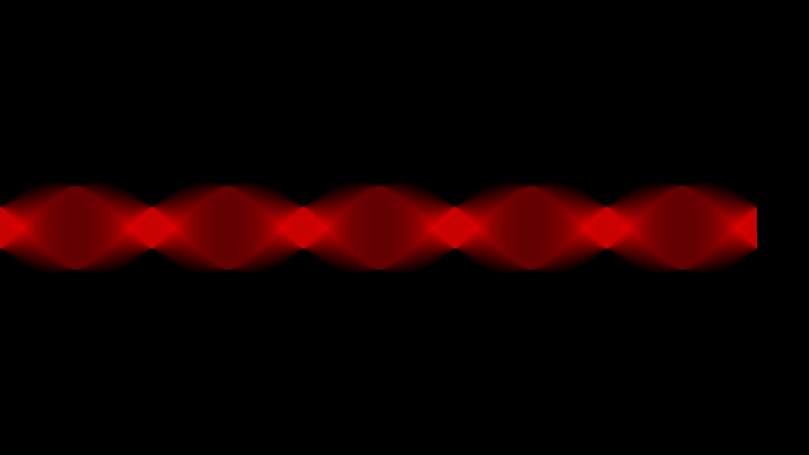

#### radon.s (linux, 258 bytes)
[radon transform](en.wikipedia.org/wiki/Radon_transform) sinogram of a 200x100 rectangle  
compilation: nasm radon.s -o radon  
requires permission to /dev/fb0 (video group or root) and access to a tty (ctrl+alt+fn\[1-6\])  
assumes 1920x1080 resolution  

#### square.s (linux, 126 bytes)
nothing interesting, simply renders a 200x200 square on the center of the screen
